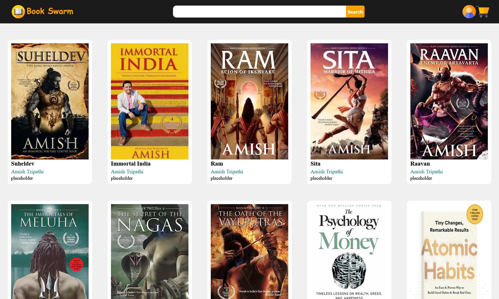

# BOOKSWARM

---

## About Project

This project was develped as a portfolio project by the developer to practice dynamic rendering(rendering items based on api response). However in this project the api response is simulated by a json file.

## Current Functionality

- Serves as dynamic item list

## Future Scope

- Add a footer
- Make UI responsive

## How to install the app

This app was bootstrapped using react.
 
To install dependencies run

`npm install`

in the directory
